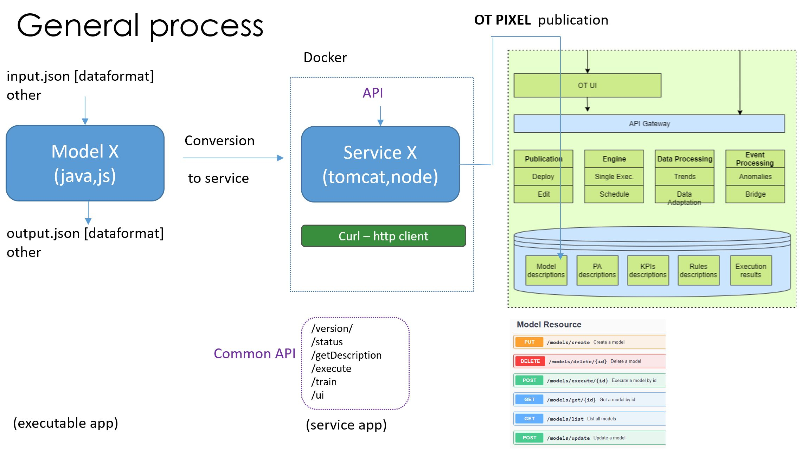

# PIXEL Operational Tools Documentation Page 

---

## Overview

The PIXEL Operational Tools are one component of the the PIXEL project (https://pixel-ports.eu/). 

The Operational Tools (OT) are mainly in charge of bringing closer to the user both the models and predictive algorithms developed within the PIXEL project. By user here we mean administrators and managers analysing port operations by means of simulation models and predictive algorithms. In order to reach that goal, a set of high-level operational tools are defined: 

   - Publish models and/or predictive algorithms
   - Edit and configure the models and/or predictive algorithms
   - Execute models and/or predictive algorithms
   - Schedule models and/or predictive algorithms to be executed at a specific time once or periodically
   - Define different operational (e.g. bottleneck detection) and environmental (e.g. PEI) KPIs, based on the data available in the information hub (from data sources, executions of models, etc.) for tracking and monitoring purposes
   - Establish some pattern detection mechanism. The most basic one is the use of triggers for a model and/or predictive algorithm. For example, when some event happens (e.g. some input changes), it may cause the relaunch of a scheduled model
   - Get the trends of a model and/or predictive algorithm (e.g. historical data)
   - Detect anomalies and raise alarms

## Architecture

The functional overview of the Operational Tools is depicted in the Figure below. Several internal components can be identified:

   - OT UI: this is the graphical interface to access (most of) the underlying functionalities. This component provides independence and autonomy, but it can be later integrated as part of the PIXEL dashboard to provide a single-entry point for administrators
   - OT API: backend API implementing the functionalities needed. This component is aligned with PIXEL security framework in order to fulfil all required security policies (e.g. authentication, authorization, etc.)
   - Publication component: it allows publishing both models and predictive algorithms. By publishing it may be necessary to deploy the models as services. Besides, the models ‘and predictive algorithms’ configurations can also be edited
   - Engine: this component is responsible for executing the different models and predictive algorithms. The execution can be invoked in real time or scheduled
   - Data processing: it is responsible for managing trends from models and/or predictive algorithms and also for some internal data adaptations required
   - Event processing: this component is responsible for real-time monitoring of indicators and conditions and trigger specific actions depending on previously configured rules. It includes a bridge to integrate with an external notification system
   - Database: the database includes description of the models and predictive algorithms that can be used, KPI description, rules as well as other configuration and output related parameters necessary for the correct behaviour of the internal building blocks. Some execution results might be stored internally besides being provided to the information hub.

## Components

The Operational Tools has been developed into the following modules 

  - Check [ot-api](https://inter-iot.readthedocs.io/projects/gateway/en/latest/)
  - Check [ot-planner](https://inter-iot.readthedocs.io/projects/gateway/en/latest/)
  - Check [ot-ui](https://inter-iot.readthedocs.io/projects/gateway/en/latest/)

## API

The PIXEL Operational Tools provides an OpenAPI specification 

   - TBC

## Integration with PIXEL models

The Operational Tools have as mission the adaptation, execution (and orchestration) of the models developed within the project to let the rest of platform components and PIXEL users to manage, control and obtain results out of the models. The same applies for the predictive algorithms and also for the PEI that is conceived also as a model. This implies the exposition of two interfaces: one interface to wrap the heterogeneous models into a common format (standardization) and a second to expose the module features for the rest of components and users.  However, the whole process requires to be decomposed into several steps to guarantee modularity and flexibility.

The process is depicted in the Figure below. 
A model is supposed to be provided as a typical executable file. This initial model (model X in figure below) can be developed in different programming languages (Java, JavaScript). Each model is supposed to interpret one JSON file as input and provide one JSON file as output, with a specific data format. Working with JSON formats is widely accepted good practise to work with open interfaces due to its conciseness and readability. However, some proprietary models may require a special treatment where the conversion from formats may be inefficient; therefore, it is possible to support other formats and encapsulate the proprietary format (part or all the input) also into a JSON format as raw data. 

The initial model is then converted into a service (see service X in figure below) that encapsulates the functionality and allows to be invoked with a REST API. For maximum flexibility, the service is further encapsulated into a Docker instance, able to be deployed anywhere (not only in the PIXEL platform). A common API has been specified for such service to support a wide range of functionalities: versioning, monitoring, execution, training (mainly for predictive algorithms) and user interface. The use of Docker for containerisation also allows including certain libraries at OS level that can facilitate extended functionalities to the service. As example, the CURL library is able to provide HTTP access to external services.

The containerised version of the service enters then in the PIXEL platform through the OT, at publication phase. A new entry in the PIXEL data model is added, representing the model (as a service). The entity includes different attributes (name, inputs, outputs, endpoints, etc.) that can be later queried. The publication API in the Operational Tools allows publishing the service as a Docker image or as an external service (the Docker instance is already deployed). 

## Code and Docker instances

The code and Docker instances are available on open repositories (github and dockerhub) 

  - Check [ot-api](https://gitpixel.satrdlab.upv.es/benmomo/ot-model-planner)
  - Check [ot-planner](https://gitpixel.satrdlab.upv.es/benmomo/ot-model-planner)
  - Check [ot-ui](https://gitpixel.satrdlab.upv.es/benmomo/ot-ui-basicModel)
 
