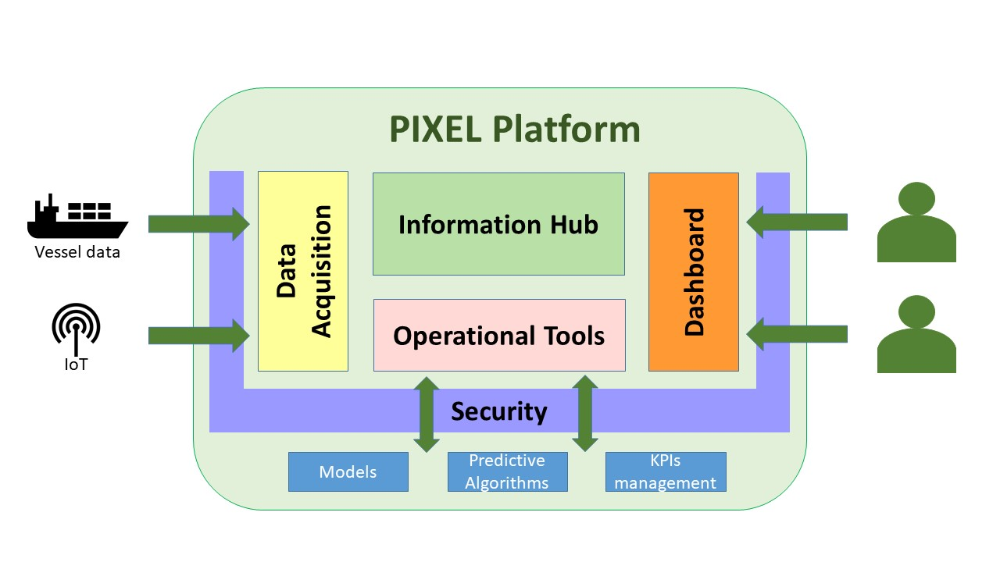
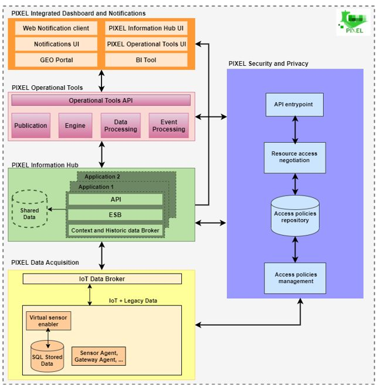
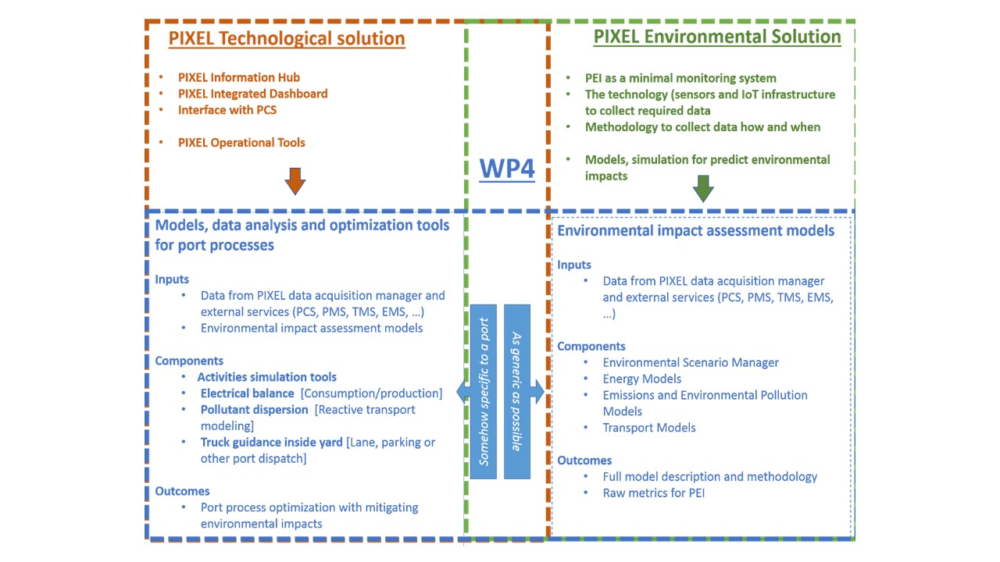
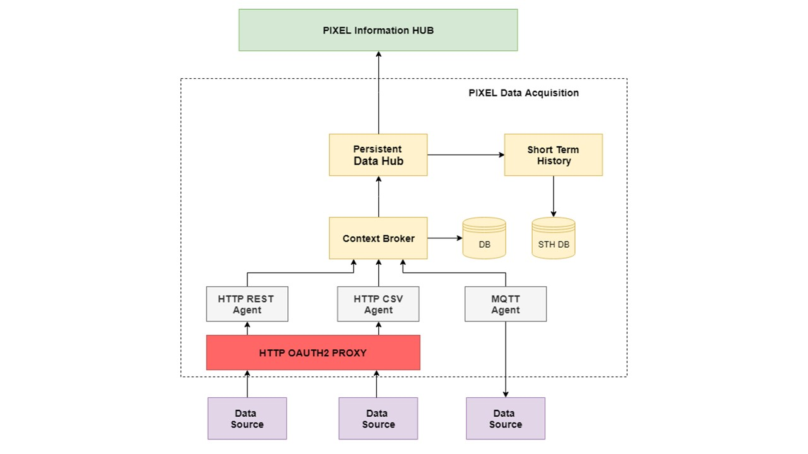
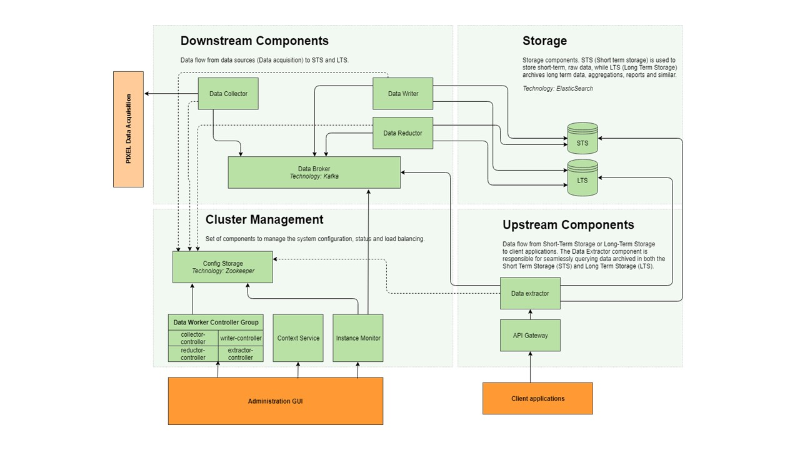
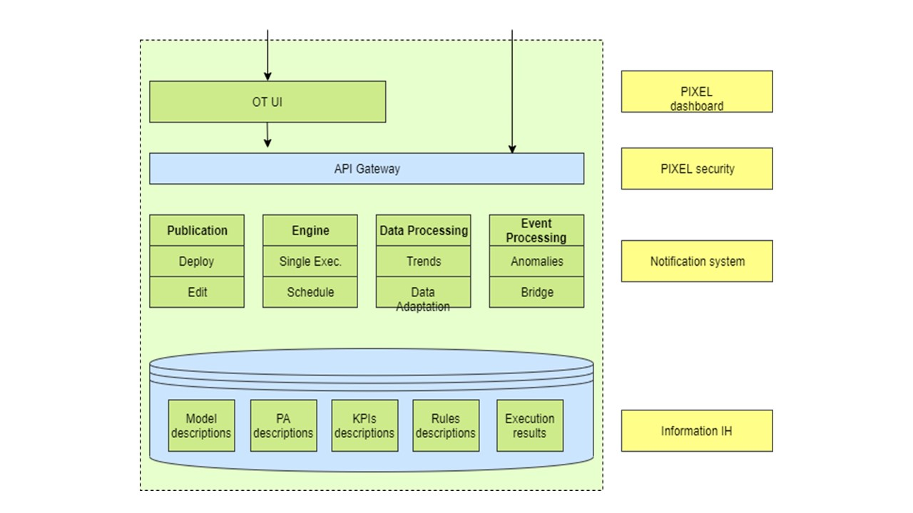
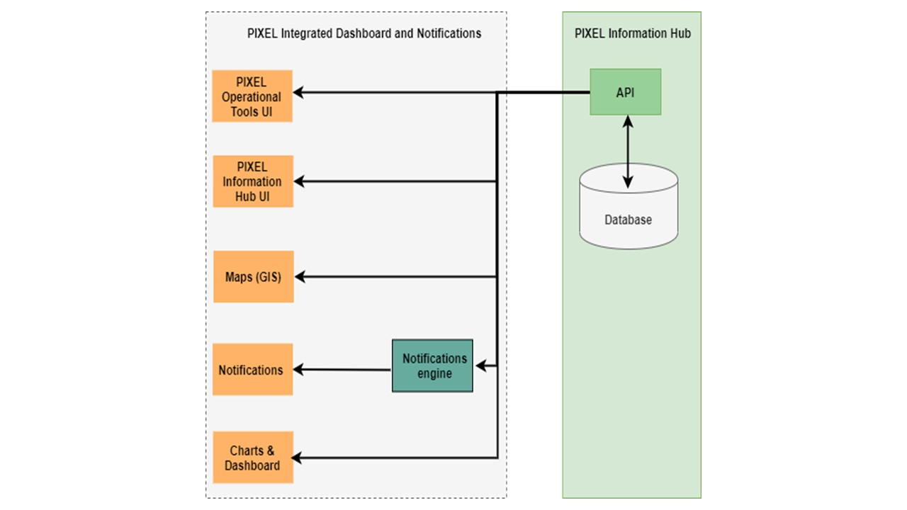
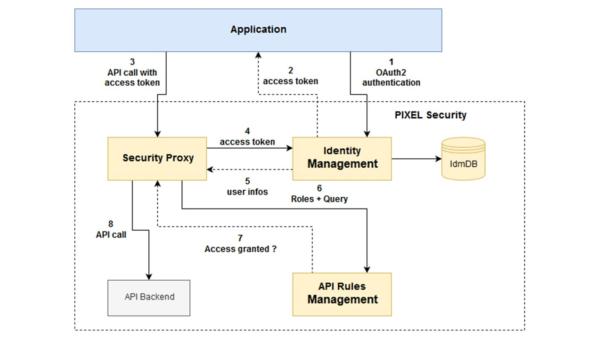

# PIXEL Documentation Page 

---

## Overview

This is the documents hub for the PIXEL project (https://pixel-ports.eu/).

> *PIXEL is the first smart, flexible and scalable solution for reducing environmental impacts while enabling the optimization of operations in port ecosystems through IoT.*

PIXEL enables a two-way collaboration of ports, multimodal transport agents and cities for **optimal use of internal and external resources, sustainable economic growth and environmental impact mitigation, towards the Ports of the Future**. Built on top of the state-of-the art interoperability technologies, PIXEL centralises data from the different information silos where internal and external stakeholders store their operational information. PIXEL leverages an **IoT based communication infrastructure** to voluntarily exchange data among ports and stakeholders to achieve an efficient use of resources in ports.

PIXEL has been financed by the Horizon 2020 initiative of the European Commission, contract 769355  

  

## Main Concepts and Architecture

The PIXEL platform aims at covering various challenges and facilitating operations at ports. Heterogeneous data including IoT sensors must be gathered and exchanged across different stakeholders operating at ports. Typically these data are difficult to handle due to a lack of homogenization and tools to operate them. 
By using (extended) **FIWARE data models**, PIXEL brings clarity, homogeneity and common semantics to such data. Furthermore, these data are also treated and exploited by means of specific **models** and **predictive algorithms** (e.g. energy, pollution, traffic, etc.) which help defining environmental and operational KPIs at ports. Last but not least, data access and treatment is presented through a **powerful user-friendly dashboard** to port operators (and eventually other port stakeholders).

   
The PIXEL architecture is divided into several building blocks to cover a wide range of needs for **small, medium and large ports**. The approach is **data-centric** so that multiple stakeholders and applications can homogeneously access to the data and provide added value services on top of them. 

 

<!--  -->

 

You can see a short video presentation with more information about PIXEL in our **Youtube channel**
 

  

## Data Models

   
The PIXEL Data Models are based on **FIWARE data models**, which have been harmonized to enable data portability for different applications including, Smart Cities, Smart Agrifood, Smart Environment, Smart Sensoring, Smart Enery, Smart Water and others domains. The PIXEL application domain refers to ports and port operations but we will follow and extend the FIWARE data model methodology.

   - Check more information about [FIWARE Data Models](https://www.fiware.org/developers/data-models/). It also has a [ReadTheDocs](https://fiware-datamodels.readthedocs.io/en/latest/) documentation repository.
   - Check some [PIXEL data models](https://pixel-ports.eu/) (TODO)
  

## Models

   
Ports activities undeniably have an impact on their environment, the city and citizens living nearby. To have a better understanding of these impacts, the ports of the future will require tools allowing suitable **modelling, simulation and data analysis**. Based on the reality of port activities and available data, the PIXEL platform provides various models as useful tools. This will help them to have a better understanding of their environmental impacts. These models are focused on: 

  - Modelling of the **supply chain and port’s activities** (type of machine, duration of use, position in the port) to enable us to build **activity scenarios** that are used to identify the **energy sources, local emissions of pollutants but also to estimate the flow of cargoes** entering or leaving the port. Check the [latest documentation](https://pixel-ports.eu/) with tutorials and code access (TODO).
  - Modelling of **consumption and energy production** of the port with the aim of moving towards **green energy production**. For operational actors in ports, energy efficiency is an important issue, both from the environmental and economic perspectives. In order to optimize the energy flows inside the port, a prerequisite is to manage and quantify energy consumption and production in the context of complex industrial processes. Check the [latest documentation](https://pixel-ports.eu/) with tutorials and code access (TODO).
  - Modelling of **congestion of multi-modal transport networks** to reduce the impact of port traffic on the network. The model will help to understand if a different traffic management has a positive impact on congestions issues, citizens risk on the road and environmental impacts. Check the [latest documentation](https://pixel-ports.eu/) with tutorials and code access (TODO).
   - Modelling of **environmental pollution** of the port to reduce the environmental impacts of the port on the city and its citizens. These simulations can assist the port manager/operator in the **decision-making process** in order to optimize various activities within the port and minimize their impact on the environment. Check the [latest documentation](https://pixel-ports.eu/) with tutorials and code access (TODO). 

 

## Predictive Algorithms (PAs)

**Artificial Intelligence (AI)** is becoming one of the main factors in a successful digital transformation of the ports. Larger ports are increasingly becoming aware of the value that is present in a daily collected operational data. The ability to harness **operational insights** from vast amounts of data that is collected in the ports, will be one of the main advantages of future ports to make them **more efficient** in terms of energy efficiency, hinterland multimodal transport needs and to better anticipate harmful actions.
The PIXEL predictive algorithms are able to make following predictions: 

  - **Prediction of vessel call data from FAL forms and other sources**: internal data about vessel calls is utilized to predict vessel calls and their durations. General statistical analysis and visualizations are also performed. Vessel call data is available in every port as is obtained from FAL forms which are legally required, thus making this task generally applicable to every port at a low cost. Internal vessel call data that was identified is presented along with the detailed descriptions of the subtasks, methodology and initial results. Check the [latest documentation](https://pixel-ports.eu/) (TODO)
  - **Analysis and prediction of road traffic conditions with connection to port operations**: here hinterland multimodal transport requirements for various ports (Port of Monfalcone, Port of Piraeus and Port of Thessaloniki) are addressed. A common task of short-term traffic volume prediction was identified. Predictions are correlated with port operations to provide estimates on the impact that congestions have on them. Different data sources were identified, mainly from regional road operators or openly available data. Check the [latest documentation](https://pixel-ports.eu/)  with tutorials and code access (TODO).
  - **Prediction of renewable energy production**: this output provides ports with the ability to estimate the potential of renewable energy production for different time resolutions. it was focused on Port of Bordeaux use case, but the developed methods are general and applicable for any port. Different open data sources are identified about the weather and measured photovoltaic power. Live, as well as historical data sources are presented, with initial results based on this data. Check the [latest documentation](https://pixel-ports.eu/)  with tutorials and code access (TODO).

  
  

## Data Acquistion Layer (DAL)

   
The PIXEL Data Acquisition Layer consists of several components designed to push data from the several data sources available and the PIXEL Information Hub. The solution provides a standard way to acquire data from different data sources that implements different kind of protocols and different data types.
The idea is to provide a standard way to import data into the PIXEL Information Hub in order to allow an easy use of any kind of data sources available on ports. 

Check the [latest documentation](https://pixel-ports.eu/)  with tutorials and code access (TODO).

 

## Information Hub (IH)   

   
The PIXEL Information Hub consists of several parts conceptually divided into components that push data toward the database (downstream); components involved in stored data retrieval and further processing (upstream) and components responsible for data persistence and storage. In addition, the system provides supporting services for configuring, managing and monitoring the PIXEL Information Hub.

Check the [latest documentation](https://pixel-ports.eu/)  with tutorials and code access (TODO).

 

 
##  Operational Tools (OTs)

   
The Operational Tools (OT) are mainly in charge of bringing closer to the user both the models and predictive algorithms developed in PIXEL. By user here we mean administrators and managers analysing port operations by means of simulation models and predictive algorithms. In order to reach that goal, a set of high-level operational tools are defined, such as publishing, editing,executing and scheduling models and predictive algorithms. KPI managament is also facilitated by the Operational Tools.

Check [latest documentation](https://docs-hub-ot.readthedocs.io/)  with tutorials and code access (TODO). 

  
 
  
## Dashboard and Notification (DN)

   
The PIXEL Integrated Dashboard and Notifications is designed to show the data available from the PIXEL Operational Tools and also from the IH. These data are the result of:
- Retrieving data from IoT and other information sensors
- Apply (execute) predictive algorithms and models.
- Calculate the PEI.
- Notifications from Event Processing. Whenever a rule is met, a notification will be received.

These data are represented to the platform user via three main channels:
- Charts & Dashboard: Visualization of the data received from the different data sources (devices, sensors), results of simulations, predictions, etc.
- GIS: Geolocated data (sensors, devices, services, data result) is represented in a map view, which offers the geospatial interpretation of the data and allows interpolation of information, detecting potential sources of anomalies, etc. 
- Notifications: Coming from executions of predefined rules/conditions, this channel allows the transmission of high-importance or actionable information to the appropriate addressee(s), doing it in the specific moment when the information is useful for informed decision-making, establishing prevention mechanisms or doing meaningful reports.

Check the [latest documentation](https://pixel-ports.eu/)  with tutorials and code access (TODO).

 

## Security and Privacy (S&P)

   
The PIXEL Security solution is in charge of providing a solution to identify and authenticate users that could be connected to existing identity management solutions already deployed in ports, and also of providing a solution to control the access of the data managed by the PIXEL platform.
The solution provides an API Gateway based on OAuth2 mechanism in order to protect the access of the different API exposed by PIXEL. The Gateway also implements XACML rules in order to define access rules based on API URL and VERBS and the user roles.
The security solution provides also an Identity Management solution that can be used by other PIXEL components to share the same user identity across all platforms.

Check the [latest documentation](https://pixel-ports.eu/)  with tutorials and code access (TODO).

 
  

 
